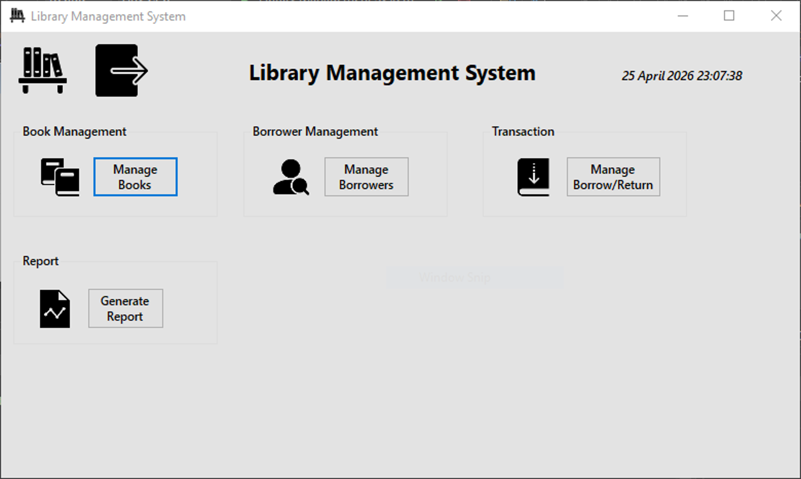

# Library Management System - Dimitri Sabra


## Overview

Library Management System is a desktop application built with **VB.NET Windows Forms**. It helps manage library books, borrowers, borrowing and return transactions, authentication, and returned-book reports.

The application now uses an automatic **local SQLite database**, so it can run without manually installing or configuring SQL Server.

## Login Credentials

| Username | Password |
| --- | --- |
| `admin` | `123` |

## Features

- User authentication with a login screen
- Add, search, delete, and view books
- Add, search, delete, and view borrowers
- Manage book borrowing and return transactions
- Track due dates and borrowing dates
- Calculate total returned-book profit
- Export returned-book reports as PDF files
- Auto-created local SQLite database

## Screenshots

| Authentication | Dashboard |
| --- | --- |
|  |  |

| Book Management | Borrow / Return |
| --- | --- |
|  |  |

## Tech Stack

- **Language:** VB.NET
- **Framework:** .NET 9 Windows Forms
- **Database:** SQLite via `Microsoft.Data.Sqlite`
- **Reports:** iTextSharp PDF generation
- **IDE:** Visual Studio

## Run the Project

1. Clone the repository.
2. Open `Library Management System - Dimitri Sabra.sln` in Visual Studio.
3. Restore NuGet packages.
4. Build and run the project.
5. Log in using:

```text
Username: admin
Password: 123
```

The database is created automatically at:

```text
%LOCALAPPDATA%\Library Management System\library.db
```

## Project Structure

```text
Library Management System - Dimitri Sabra/
+-- Library Management System/
|   +-- Form1.vb
|   +-- MainForm.vb
|   +-- BooksForm.vb
|   +-- BorrowerForm.vb
|   +-- ManageBooksForm.vb
|   +-- GenerateReportForm.vb
|   +-- Database.vb
+-- Authentication Module.png
+-- Dashboard.png
+-- Book Management Module.png
+-- Borrow Return Module.png
+-- library.sql
+-- README.md
```

## Author

Developed by **Dimitri Sabra**.
